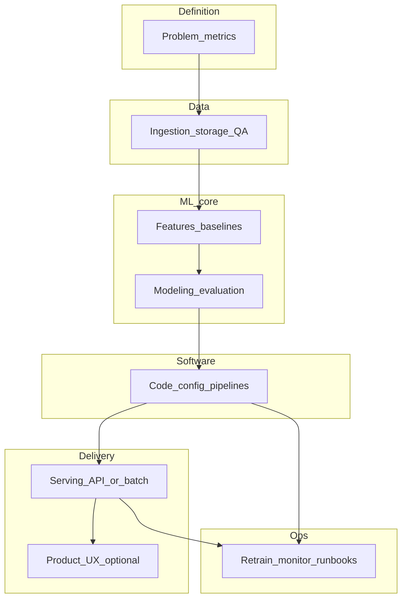

# Crop price prediction — project guide

This document is the end-to-end guide for the **crop_price_prediction** repository. It is structured so you can work through the project in order and see what an AI assistant can help implement versus what you must do yourself.

**Note:** No `PROJECT_OVERVIEW.md` (or similar) was present in the repo when this guide was created. Sections marked **Open decisions** should be filled in from your real overview, stakeholders, or data availability—then tighten the checklists accordingly.

---

## Executive summary

Build a reproducible system to **forecast crop prices** (or related market indicators) for chosen crops, regions, and time horizons. Work flows from **problem definition and data** through **features and baselines**, **modeling and evaluation**, **software packaging**, optional **serving** (batch or API), optional **product UI**, and **operations** (retraining, monitoring). Success means documented metrics on held-out time periods, clear assumptions, and a path to refresh data and redeploy without ad-hoc steps.

Until you add a written overview, treat **geography, crops, horizon, data sources, and consumers** as unset; resolve them under [Open decisions](#open-decisions) before heavy implementation.

---

## Open decisions (you)

Resolve these explicitly; they drive data, modeling, and delivery shape.

| Topic | Question |
|--------|----------|
| Geography | Which countries, markets, or mandis? |
| Crops | Which commodities and units (per kg, per quintal, etc.)? |
| Horizon | Days, weeks, or months ahead? |
| Target metric | Price level, return, volatility band? |
| Data sources | Official prices, exchange, surveys, weather, trade—what is allowed and licensed? |
| Consumers | Analysts only, farmers, traders, internal dashboard? |
| Deployment | Local scripts, cloud batch, REST API, mobile—what is in scope? |
| Refresh cadence | Daily, weekly retrain? Who approves model promotion? |

---

## System parts

Logical components of the system (adjust names when your overview differs).

1. **Problem definition** — Crops, regions, forecast horizon, success metrics, business constraints (latency, explainability).
2. **Data** — Ingestion, storage layout, quality checks, versioning, PII/licensing boundaries.
3. **Features and baselines** — Seasonality, lags, calendar effects, optional weather or macro; naive and linear baselines before complex models.
4. **Modeling** — Time-aware train/validation splits, model families, hyperparameters, uncertainty if needed.
5. **Software** — Repository layout, dependencies, configuration, training entrypoints, optional experiment tracking.
6. **Serving** — Batch forecasts (files/DB) and/or an API; input/output contracts.
7. **Product / UX** — Optional dashboard or app for end users.
8. **Operations** — Scheduled jobs, monitoring (data drift, performance), backups, runbooks.

---

## End-to-end roadmap (phases)

Phases are ordered; later phases assume earlier ones are at least minimally done.

| Phase | Goal | Depends on |
|-------|------|------------|
| 0 | Lock open decisions; define metrics and horizon | — |
| 1 | Data access, legal/licensing, raw storage | Phase 0 |
| 2 | Cleaning, QA, reproducible datasets | Phase 1 |
| 3 | Feature spec + baselines | Phase 2 |
| 4 | Models, backtests, model selection | Phase 3 |
| 5 | Package training/inference; configs; tests | Phase 4 |
| 6 | Serving (batch or API) if in scope | Phase 5 |
| 7 | UI / product if in scope | Phase 6 or 5 |
| 8 | Ops: schedules, monitoring, promotion process | Phase 5+ |

---

## Checklist: automatable / pair-programming (AI-assisted)

Work you can drive with an AI coding assistant in this repo. Check items off as you complete them.

### Phase 0 — Definition

- [ ] Draft `README.md` or extend this guide with finalized decisions from [Open decisions](#open-decisions).
- [ ] Write a one-page metrics spec (e.g. MAPE, RMSE, directional accuracy) tied to forecast horizon.
- [ ] Add a minimal `pyproject.toml` or `requirements.txt` once stack is chosen.

### Phase 1–2 — Data

- [ ] Define folder layout for `data/raw`, `data/processed` (or equivalent) and document it in-repo.
- [ ] Implement ingest scripts (API scrape, CSV load, DB export) **once you have data location/format**.
- [ ] Implement validation checks (missing dates, outliers, unit consistency).
- [ ] Notebook or script: EDA summary (distributions, seasonality plots).

### Phase 3 — Features and baselines

- [ ] Feature pipeline module (lags, rolling stats, calendar features).
- [ ] Baseline models (seasonal naive, moving average, linear).
- [ ] Reproducible script: `features` → `train_baseline` → metrics output.

### Phase 4 — Modeling

- [ ] Time-based split utilities (no random shuffle for time series).
- [ ] Train/eval scripts for chosen libraries (e.g. sklearn, LightGBM, statsmodels, Prophet—pick per problem).
- [ ] Save/load artifact format (e.g. `joblib`, `onnx`, native model files) and document versions.

### Phase 5 — Software quality

- [ ] Single CLI or Makefile targets: `lint`, `test`, `train`, `predict`.
- [ ] Unit tests for feature logic and split logic.
- [ ] Configuration via env or YAML; no secrets in git.

### Phase 6 — Serving (if in scope)

- [ ] Batch prediction script writing Parquet/CSV or updating a table schema doc.
- [ ] Or minimal FastAPI/Flask app with health check and prediction endpoint + request/response schema.

### Phase 7 — Product / UX (if in scope)

- [ ] Wire UI to API or static exports; basic error and loading states.

### Phase 8 — Ops (lightweight first)

- [ ] Document manual retrain steps; then optional cron/GitHub Actions for scheduled runs.
- [ ] Log metric snapshots per run (file or table) for comparison over time.

---

## Checklist: manual (you)

These require your accounts, approvals, judgment, or access that cannot be delegated to code alone.

### Accounts, legal, and access

- [ ] Confirm **rights to use** each dataset (license, terms of use, attribution).
- [ ] Create or obtain **API keys / DB credentials** for external data; store in a secrets manager or local env—not in the repo.
- [ ] If cloud is used: create **billing account**, project, IAM roles; decide who pays.

### Data and domain

- [ ] **Source** official or market price feeds (government portals, exchanges, partners).
- [ ] **Validate** units and geography with a domain stakeholder (wrong market = useless model).
- [ ] Decide **policy** for missing data, holidays, and structural breaks (policy reforms, shocks).

### Modeling and product decisions

- [ ] **Approve** target metric and horizon for v1 (prevents endless retuning).
- [ ] **Sign off** on model risk: who is allowed to act on forecasts; disclaimers if public-facing.

### Deployment and operations

- [ ] **Choose** hosting (local, VPS, AWS/GCP/Azure) and register DNS/SSL if public API or site.
- [ ] **Define** who promotes a model to “production” and how rollbacks work.
- [ ] **Schedule** retraining or approve automation budget and alerts.

### Stakeholders

- [ ] Demo to users or sponsors; collect feedback for phase 2 scope.

---

## How to use this guide

1. Fill [Open decisions](#open-decisions) (copy the table to a shared doc if needed).
2. Work phases **0 → 8** in order, skipping serving or UI if out of scope.
3. Keep **automatable** tasks in git; track **manual** tasks in your own task system or by checking boxes here.

When you add a real `PROJECT_OVERVIEW.md`, update the **Executive summary** and **System parts** to match it verbatim intent—this file is the operational spine, not a substitute for your product spec.
